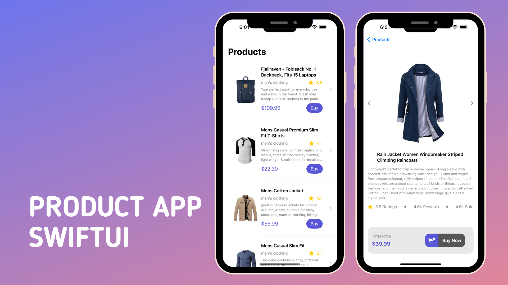

# SwiftUI Product Showcase App

## Overview

This SwiftUI project showcases a beautiful Product List and Detail Screen for iOS apps using SwiftUI. It incorporates async-await API calls to fetch product data from the [FakeStoreAPI](https://fakestoreapi.com/products).

## Features

- 📱 **Product List Screen:** Display a list of products with attractive UI.
- 🖼️ **Async Await API Calls:** Utilize Swift's async-await to fetch product data asynchronously.
- 🌟 **Product Detail Screen:** Create a stunning product details screen with Async Image, HStack, VStack, and more.
