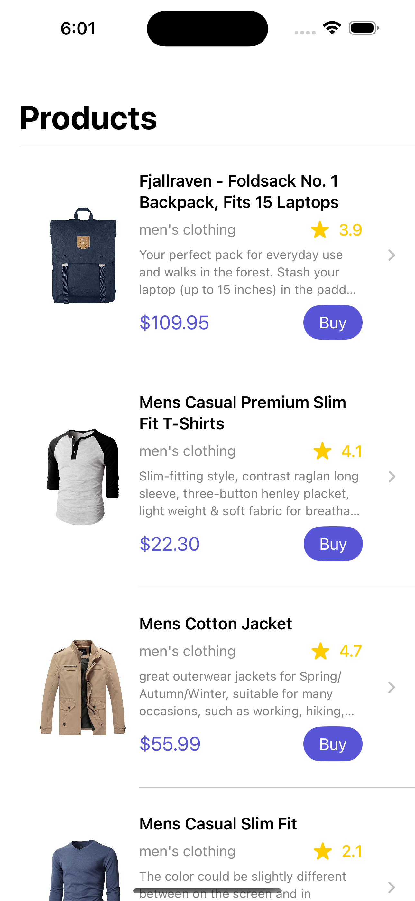
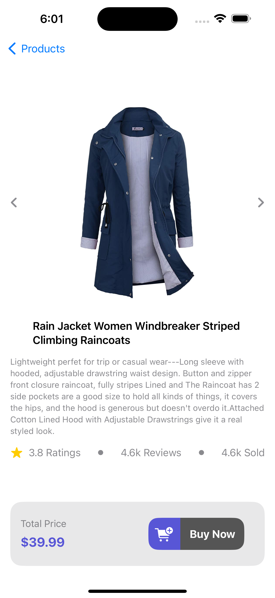

# SwiftUI Product Showcase App


## Overview

This SwiftUI project showcases a beautiful Product List and Detail Screen for iOS apps using SwiftUI. It incorporates async-await API calls to fetch product data from the [FakeStoreAPI](https://fakestoreapi.com/products).

## Features

- 📱 **Product List Screen:** Display a list of products with attractive UI.
- 🖼️ **Async Await API Calls:** Utilize Swift's async-await to fetch product data asynchronously.
- 🌟 **Product Detail Screen:** Create a stunning product details screen with Async Image, HStack, VStack, and more.

## API Endpoint

The project fetches product data from the [FakeStoreAPI Products Endpoint](https://fakestoreapi.com/products).

## How to Use

1. Clone the repository to your local machine.
   ```bash
   git clone https://github.com/your-username/your-repository.git
   ```

2. Open the project in Xcode.

3. Build and run the app on the iOS simulator or a physical device.

## Dependencies

The project relies on SwiftUI for the UI components and Swift's async-await for handling asynchronous API calls.

## Screenshots


*Caption: Beautiful Product List Screen*


*Caption: Stunning Product Detail Screen*
